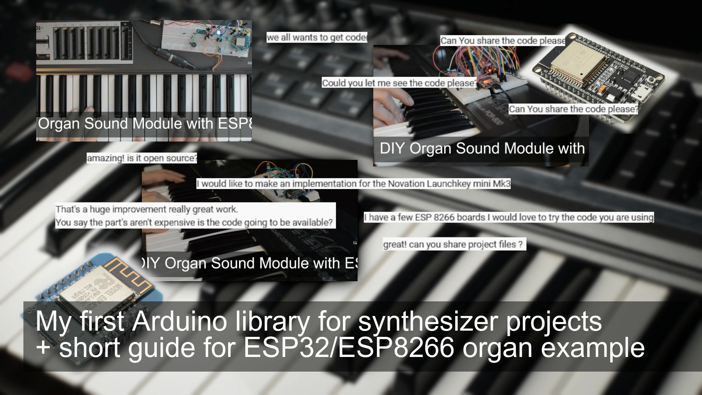

<h1 align="center">ML_SynthTools</h1>
<h3 align="center">An Arduino synthesizer library</h3>  

 
   
  <a href="https://youtu.be/9AHQ4mQrjE8">link to the video</a>

# Introduction

This library is made to be used for synthesizer projects. It contains modules to create sound, to drive an audio codec and create some audio effects. 

In this documentation you will find:
- information about supported platforms
- information about the supported modules of this library

There are some references to the organ project because this was the first which supports the highest count of platforms/boards.

# Platform support

This library supports different platforms:
- ESP32, ESP32S2, ESP32S3
- ESP8266
- Seeedstudio XIAO (samd21 - cortex-m0plus)
- Teensy 4.1 (imxrt1062)
- Daisy Seed (cortex-m7)
- Raspberry Pi Pico (rp2040)
- STM32F407 (cortex-m4)

The organ example can be found here: https://github.com/marcel-licence/ml_synth_organ_example

All platforms are tested. Actually the sound quality might be a bit limited.
The organ supports full polyphony (you can play all 64 notes of the upper manual at the same time).
You can modify the sound using 9 drawbars.
Percussion is supported (2nd, 3rd).
A simple rotary implementation creates a simple (noisy) leslie like sound.

Demo using ESP32, ESP8266: https://youtu.be/c7TL8jcrnzs
Demo using the XIAO: https://youtu.be/2wT8nByoUNw
Demo using the Teensy4.1: https://youtu.be/H-NDCQnSDV0

More information will be available in future

# Modules of this library

The library contains the following modules:
- midi module <a href="extras/midi_input.md">more details</a>
- arpeggiator <a href="extras/ml_arp.md">more details</a>
- board pinout definitions <a href="extras/ml_boards.md">more details</a>
- a simple delay <a href="extras/ml_delay.md">more details</a>
- a simple reverb [more details](extras/ml_reverb.md)
- organ sound generator <a href="extras/ml_organ.md">more details</a>
- saw/square pulse width modulated oscillator <a href="extras/ml_oscillator.md">more details</a>
- vu meter (helper) <a href="extras/ml_vu_meter.md">more details</a>
- oled scope <a href="extras/ml_scope.md">more details</a>
- midi file stream player <a href="extras/ml_midi_file_stream.md">more details</a>
- mod tracker module <a href="extras/ml_mod_tracker.md">more details</a>

# Board definitions

There are a lot of audio boards available on the market (for example ESP32-Audio-Kit).
For that reason you can use some of the existing board includes to get all defines
required to set up your board, codec etc.
-> please look here for more information <a href="extras/ml_board.md">more details</a>

# Examples

There are some "multi-platform" examples available (click the link for more details):
- <a href="https://github.com/marcel-licence/ml_epiano_example">ml_epiano_example</a>  is a full-polyphone e-Piano like sounding synth 
- <a href="https://github.com/marcel-licence/ml_synth_basic_example">ml_synth_basic_example</a> 
- <a href="https://github.com/marcel-licence/ml_synth_multi_saw_example">ml_synth_multi_saw_example</a> creates stereo multi saw (like supersaw etc.) sounds 
- <a href="https://github.com/marcel-licence/ml_synth_organ_example">ml_synth_organ_example</a> is a full-polyphone organ implementation trying to work like a real tonewheel organ 
- <a href="https://github.com/marcel-licence/ml_synth_pwm_osc_example">ml_synth_pwm_osc_examples</a> A synthesizer module sounding a bit like the Alpha Juno. It's strength is the pulse sound with a modulated pulse-width. 
- <a href="https://github.com/marcel-licence/ml_mod_tracker">ml_mod_tracker</a> A MOD file player. It is a tracker implementation reminding of the Amiga game music. It plays back music of some DOS games too. 

# Compiling note

In some cases the following error might occur: 
	
	The platform does not support 'compiler.libraries.ldflags' for precompiled libraries.
	
To fix this you can look for platform.txt

Add the following line: 

	compiler.libraries.ldflags=
	
Ref: https://youtu.be/c7TL8jcrnzs?t=419
	
If you get a lot of "undefined reference to" errors the library couldn't be found by Arduino.

To support new platforms I need the information in which folder Arduino was looking for the library. 
Example:

	Compiling libraries...
	Compiling library "ML_SynthTools"
	Library ML_SynthTools has been declared precompiled:
	Precompiled library in "C:\Users\...\Documents\Arduino\libraries\ML_SynthTools\src\cortex-m4\fpv4-sp-d16-hard" not found
	Precompiled library in "C:\Users\...\Documents\Arduino\libraries\ML_SynthTools\src\cortex-m4" not found

## Compiling RP2040 (v1.13.1)

Some changes in the toolchain cause that the linker searches the lib in the cortex-m0plus instead of the rp2040 path. Please copy the ML_SynthTools.a from src/rp2040 to src/cortex-m0plus and replace the existing file in case you want to use the lib with the RP2040

---

Please feel free to share your experience and ideas. 