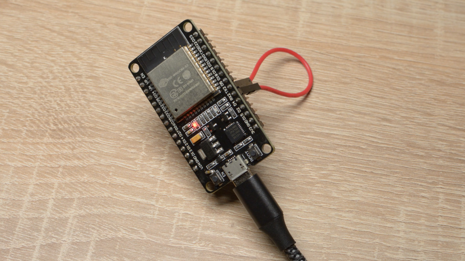
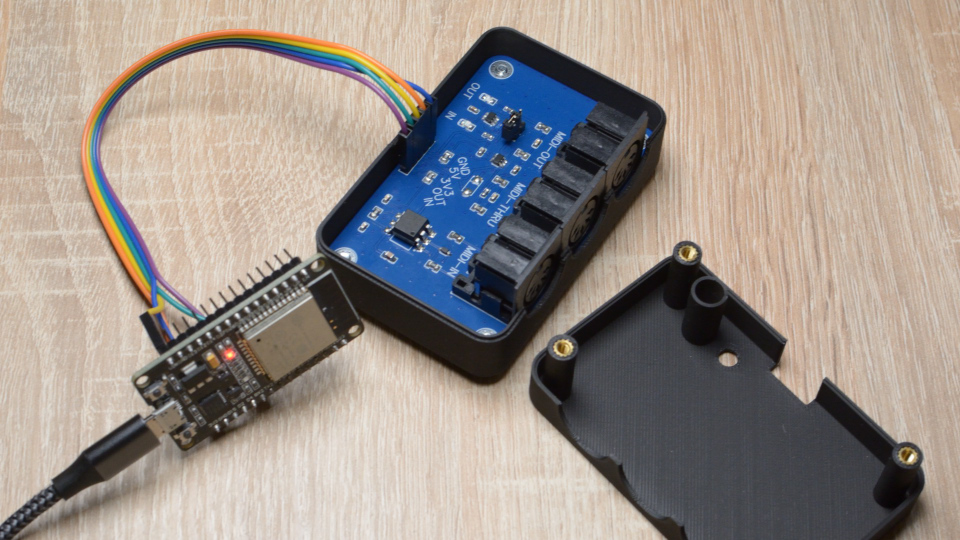
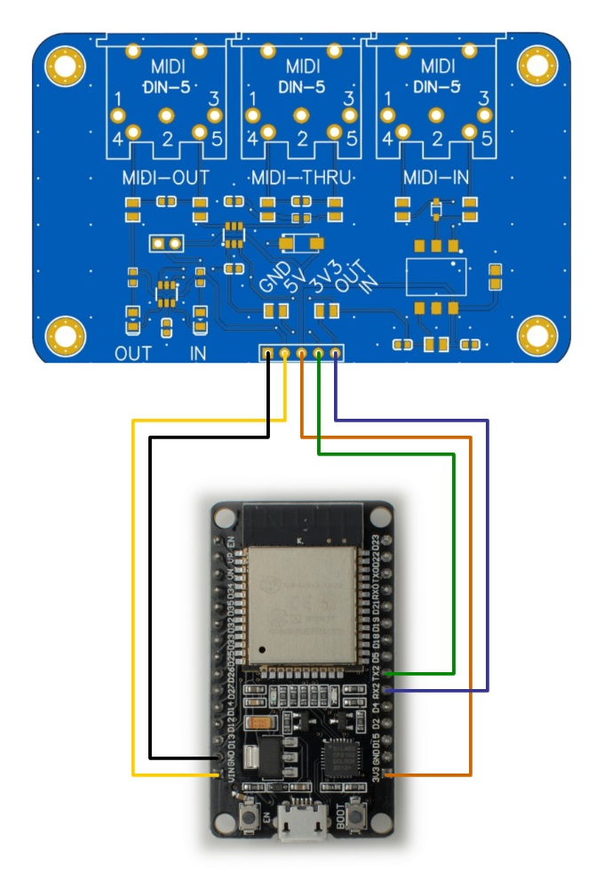

<h1 align="center">ml_midi_monitor</h1>
<h3 align="center">MIDI Monitor for Testing MIDI Serial Hardware</h3>  

 
   

> [!WARNING]  
> The `Serial1` and `Serial2` functionalities do not work with the ESP32 v3.#.# board library.  
> To ensure proper functionality, use **ESP32 board library version 2.0.17** or earlier.

# Introduction
The **ml_midi_monitor** project is designed to help you test your MIDI interface. It opens a serial port and sends a test message every second. All incoming messages are displayed in the serial monitor for easy debugging and validation.

# How to Use
## 1. Compile the Project
First, compile the project.  
Make sure you have the latest version of the **ML_SynthTools** library installed. You may also need to download the **ML_SynthTools_Lib**.

## 2. Upload the Project
Upload the project to your ESP32 (or another supported microcontroller).  
No additional hardware connections are required for this step.

## 3. Check the Serial Monitor
Open the serial monitor to verify that the project starts successfully.  
You should see startup messages, including details about the TX and RX pins being used.

## 4. Test TX and RX Pins
- Connect the **TX** pin to the **RX** pin using a jumper wire.  
  ⚠ **Do not directly connect the pins labeled TX and RX on the ESP32 board.** Instead, use the pins indicated in the serial monitor (e.g., IO16 and IO17, often labeled TX2 and RX2).  
- After connecting the pins, you should see messages appearing in the serial monitor every second.  

## 5. Test the MIDI Interface (IN and OUT)
If your setup includes a MIDI interface with both IN and OUT ports:
1. Connect the IN and OUT ports using a MIDI cable.
2. Verify that messages continue to appear in the serial monitor, indicating proper communication.

Refer to the wiring diagram below for more details:  

## 6. Test MIDI IN Only
To test MIDI input:
- Connect an external MIDI device to the **IN** port.  
- Messages from the device should appear in the serial monitor.  
  All MIDI messages across all channels will be displayed.

# Additional Notes
- Ensure your wiring is consistent with the examples provided.
- If you encounter issues, double-check your connections and the configuration of the serial monitor.

With these steps, you can easily test and debug your MIDI hardware using the **ml_midi_monitor** project. Happy testing!

# Support & Donations

If you appreciate the work done on this project and would like to support its development, I would be more than happy to accept donations!

For more information on how to donate, please send an email to:

📧 **marcel.licence.o@gmail.com**

Thank you for your support!
